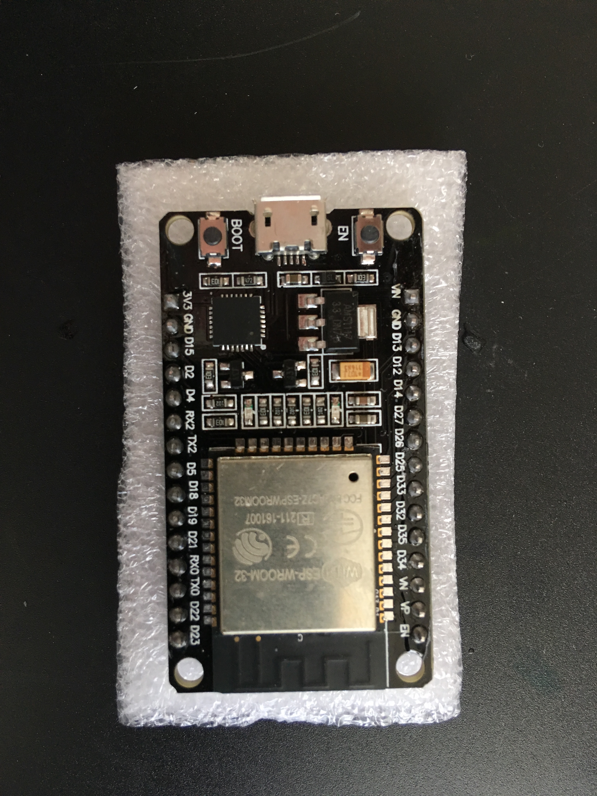
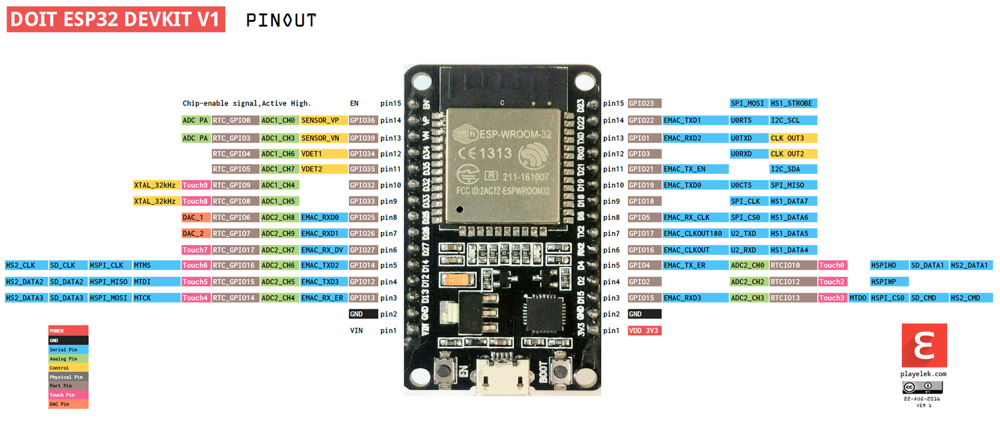

# ESP32 Information

## Hardware
* ESP32-DevKitC
    * [Spezifikation][https://www.espressif.com/en/products/hardware/esp32-devkitc/overview]
    * [Ressourcen][https://www.espressif.com/en/products/hardware/esp32-devkitc/resources]
* ESP32 (allgemein)
    * [Ressourcen][https://www.espressif.com/en/products/hardware/esp32/resources]
    * [Alles mögliche…][http://esp32.net]
* Breadboards
    * [Wiring, etc.][https://learn.sparkfun.com/tutorials/how-to-use-a-breadboard]

## Espressif IoT Development Framework@Mac	
* [Getting Started allgemein][http://esp-idf.readthedocs.io/en/latest/get-started/index.html]
    * [Getting Started ESP32-DevKit][http://esp-idf.readthedocs.io/en/latest/get-started/get-started-devkitc.html]
    * Toolchain (contains programs to compile and build the application = xtensa-esp32-elf)
        * sudo easy_install pip
        * sudo pip install pyserial
        * Download [ESP32 toolchain for macOS][https://dl.espressif.com/dl/xtensa-esp32-elf-osx-1.22.0-80-g6c4433a-5.2.0.tar.gz] 
        * mkdir ~/Programmierung/esp
        * cd ~/Programmierung/esp
        * tar -xzf ~/Downloads/xtensa-esp32-elf-osx-1.22.0-80-g6c4433a-5.2.0.tar
        * Add export PATH=$PATH:$HOME/esp/xtensa-esp32-elf/bin to ~/.profile
    * ESP-IDF (ESP32 specific API / libraries = esp-idf)
        * git clone --recursive https://github.com/espressif/esp-idf.git
        * Add export IDF_PATH=~/esp/esp-idf to ~/.profile
    * [Establish Serial Connection with ESP32][https://github.com/espressif/esp-idf.git]
        * [Install USB-Driver for ESP32][https://github.com/espressif/esp-idf.git]
* Start a project
    * ESP-IDF
        * hello_world
            * ?!make not working!?
                * [Post in Espressif-Forum][https://www.esp32.com/memberlist.php?mode=viewprofile&u=6708]
                    * rm $IDF_PATH/tools/kconfig/*.o $IDF_PATH/tools/kconfig/*.d $IDF_PATH/tools/kconfig/lxdialog/*.o $IDF_PATH/tools/kconfig/lxdialog/*.d
            * make menuconfig
                * Set USB serial port
            * make flash
                * Writes program to ESP32
            * make monitor
                * Monitors ESP32
    * Arduino 
        * [Installation instructions for Mac OS][https://github.com/espressif/arduino-esp32/blob/master/docs/arduino-ide/mac.md]
        * [Getting Started With ESP32 on a Mac Blink and LED][http://www.instructables.com/id/Getting-Started-With-ESP32-on-a-Mac-Blink-and-LED/]
        * [Example programs for ESP32 with Arduino][http://www.instructables.com/id/Getting-Started-With-ESP32-on-a-Mac-Blink-and-LED/]
        * [Examples with a Ruby UDP-Server][https://0110.be/posts/ESP32]
            * [Temperatur und Luftfeuchtigkeitsmessung][https://funduino.de/anleitung-dht11-dht22] mit [DHT11][https://akizukidenshi.com/download/ds/aosong/DHT11.pdf]

## [Mongoose OS][https://mongoose-os.com]
* [Getting started with ESP32][https://www.youtube.com/watch?v=Y6CZePh5uIA]

## Eigenes Projekt
### [Feuchtigkeits- und Temperatur-Sensor][https://www.openhacks.com/uploadsproductos/rain_sensor_module.pdf] im Heizungs- und Waschkeller
* Nachricht bei 
    * Wassereinbruch
    * Stromabfall
    * 
* [Löten][http://www.bin-br.at/Lernplattform/Script/Inhalte/Fachprak/Elek_Mod_Ger/ATTiny12P/Loetinsel-Da/loeten.pdf]
* Erreichbarkeit aus dem Internet
    * feuchtigkeit-keller.schwarze-web.de
        * S@mmer2=!8
